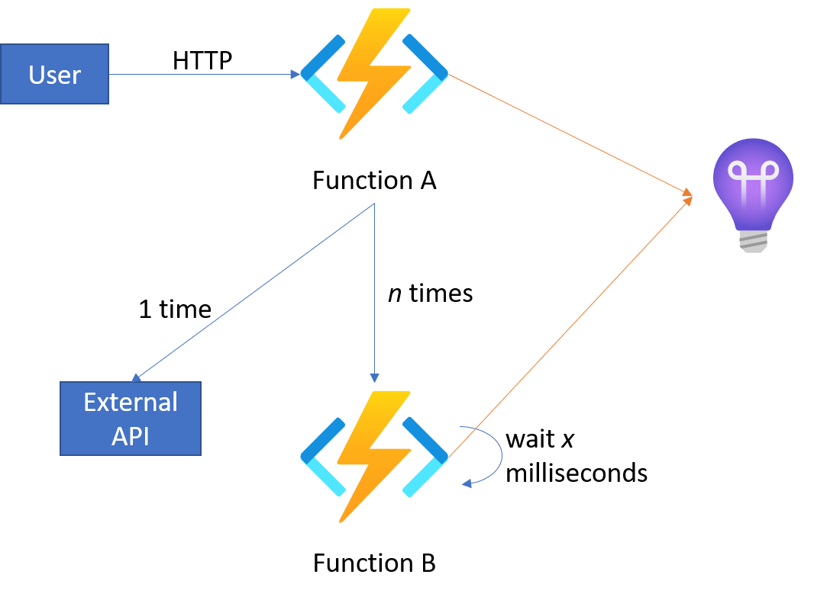
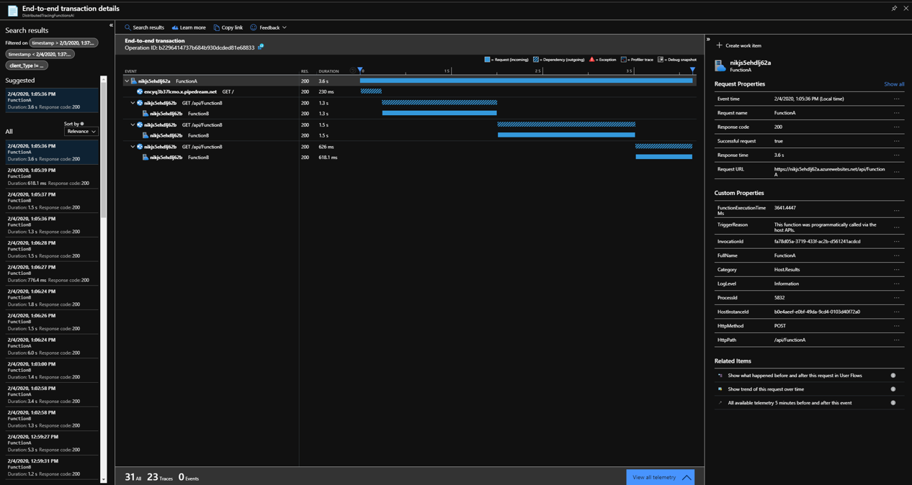
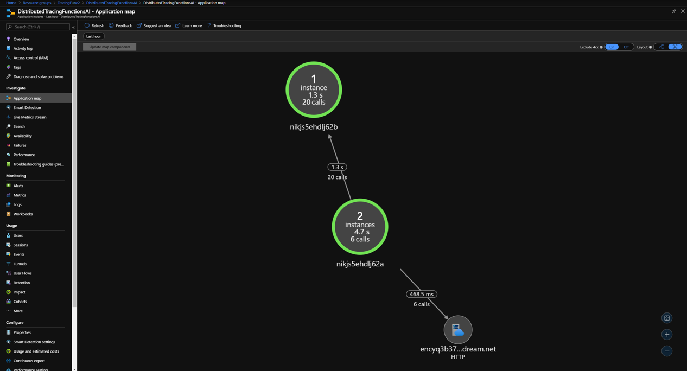

# Distributed Tracing with Azure Functions

This sample illustrates how distributed tracing in Application Insights works, with two Azure Functions acting as APIs. The first (`Function A`) is invoked by the user. This function calls:
 * An external API once.
 * Another function, `Function B`. It calls this function between 2 and 5 times.

Each time `Function B` is called, it waits between 300 and 2000 milliseconds before responding.

Both functions log to a single instance of Application Insights. Because Azure Functions has built-in support for Application Insights telemetry logging, there is no explicit configuration within the app to enable this. Note there can be a lag of a few minutes before telemetry appears within Application Insights.

Here is a diagram representing the flow of requests and telemetry:

Once the data is stored by Application Insights, t\he necessary telemetry correlation is performed, and a full dependency diagram is available for a single request:

Additionally, this telemetry enables the [application map](https://docs.microsoft.com/en-us/azure/azure-monitor/app/app-map), which provides an holistic view of the system's components:

Obviously a real-world solution will be considerably more complex, with databases, multiple external APIs, queues, etc all included. Additionally in a microservices environment this could be even more complex still. However, the same fundamental ideas apply.
